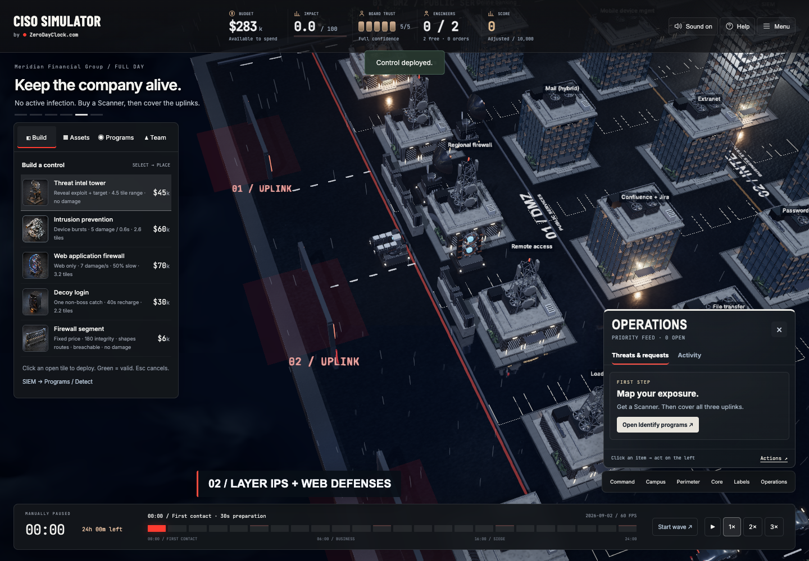

<div align="center">

# CISO SIMULATOR
### Your firewall works. Your board wants a meeting.

**Build defenses. Stop exploits. Survive the board.**

A cybersecurity tower-defense game you can play in your desktop browser.

[**PLAY IN YOUR BROWSER →**](https://game.zerodayclock.com) · [**PUBLIC SCOREBOARD ↗**](https://game.zerodayclock.com/scoreboard) · [Bring your own data](docs/DATA-SOURCES.md)

[](https://game.zerodayclock.com)

*Actual gameplay, edited and accelerated. Build → scan → defend. No install. No login.*

[Download the high-resolution MP4](https://github.com/eppser/ciso-simulator/raw/refs/heads/main/docs/media/gameplay.mp4) · **Desktop only** · Three difficulties · ~22 minutes at 1×

[](https://github.com/eppser/ciso-simulator/actions/workflows/release.yml)

</div>

Congratulations. You're the **Chief Information Security Officer**.

Your reward: ransomware, supply-chain compromise, a suspicious remote contractor, a regulator with questions, and a vendor who smells an emergency budget.

**Keep the company alive. Keep the board on your side. Try not to buy the same solution twice.**

## This is tower defense. The tower budget is your problem.

| BUILD THE ROUTE | HOLD THE LINE |
|---|---|
|  |  |
| Cheap firewall segments let you shape paths. Deploy controls where their range matters. | IPS handles device exploits. WAF slows web attacks. Walls can be breached; credentials can bypass them. |

**Your first minute:** pick a company → buy a Scanner in **Programs → Identify** → build defenses across the three uplinks → follow threats and requests in **Operations**.

You start with full board trust. What happens next depends on your decisions.

**[Take the chair →](https://game.zerodayclock.com)**

## A tower-defense game with a CISO's problems

- **Three fronts, not one lane.** Defend the DMZ, internal services and core systems. Threats can also start inside.
- **Different tools, different jobs.** IPS intercepts device exploits. WAF slows web payloads. Identity protection matters when the attacker already has a password.
- **Consequences you can see.** Ransomware locks buildings. Data leaves the estate. Scanned flaws light up. Engineers travel to their work.
- **People are part of the attack surface.** Handle rogue insiders, contractor fraud, stressed engineering leaders and an opportunistic vendor.
- **One Operations view.** Active threats, outstanding decisions, governance work and activity history.
- **A full day in roughly 22 minutes at 1×.** Speed up to 3×. Easy starts gently; late-game pressure ramps up.
- **Three score categories.** Business resilience, defense effectiveness, and response & leadership. Spending money is not the same as spending it well.

> Your life motto: “Patching during the board meeting” · “Professional risk accepter” · “It was DNS”

## The public scoreboard

[Open the scoreboard →](https://game.zerodayclock.com/scoreboard)

At the end of a run, choose **Compare & submit score**. Add a username and life motto, then click **Add my score** to publish them. The compact scoreboard combines all three difficulties on the current scenario and rules, using a [published difficulty allowance](docs/scoring-v24.md). Empty boards display clearly labeled seeded scores; these are not stored as player runs.

Scores are **recomputed server-side from the command journal**. Invented totals and duplicate tickets are rejected. Seeded display entries are labeled and never stored as verified runs. Usernames are pseudonyms, not verified identities; this is not a bot-proof competition.

## Real observations. Designed gameplay.

Created by [**🔴 ZeroDayClock.com**](https://zerodayclock.com), with **24h observation data from [The Shadowserver Foundation](https://www.shadowserver.org/)** informing the threat mix.

The bundled **2026-09-02** report contains **726 vulnerability/product rows and 107,025 observed attempts**. It is a fixed daily scenario, not a live feed. Waves and business consequences are designed for play—not a literal reconstruction of every connection.

## Your logs. Your infrastructure. Your very bad day.

Adapt an authorized export from **ELK / Elastic, Splunk, Sentinel, your SIEM or your honeypots** to the game's JSON schema. Load it from the opening screen. No vendor-specific live connector is bundled.

**[Data adapter guide + example →](docs/DATA-SOURCES.md)**

Imports stay in your browser and play as practice scenarios. Do not include customer data, source IPs or secrets.

Want to contribute? An aggregate **Splunk → game JSON** or **Elastic → game JSON** adapter is a great first project. Other useful contributions: accessibility, new organizations, clearer incident playbooks, and reproducible balance tests. See [contributing](CONTRIBUTING.md).

## Run it locally

```sh
git clone https://github.com/eppser/ciso-simulator.git
cd ciso-simulator
npm ci
npm run dev
```

Requires **Node 24+** and a modern WebGL-capable desktop browser. Mobile gameplay is not supported yet. Local play needs no Supabase or ElevenLabs key; the shared scoreboard needs a configured backend.

```sh
npm test
npm run build:release
node tools/super-audit.mjs
node tools/pacing-audit.mjs
node tools/firewall-economy-audit.mjs
```

## Under the hood

**Three.js + Blender-authored assets · deterministic simulation · generated voice performances · Cloudflare Pages · Supabase/Postgres with RLS**

Targets 60 FPS without lowering the artwork. See the [measured runtime optimizations and visual-equivalence tests](docs/PERFORMANCE.md).

| Change this | Start here |
|---|---|
| Organizations and assets | `src/sim/orgs.js` |
| Programs and controls | `src/sim/campaign-rules.js`, `src/sim/catalog.js` |
| Difficulty and late-game pressure | `src/sim/pacing.js` |
| Scoring and verification | `src/sim/scoring.js`, `src/sim/replay.js` |
| Your own data adapter | `src/sim/scenarios.js` |
| Campus, weather and animation | `src/render/` |
| Secure scoreboard | `server/`, `src/ui/leaderboard.js` |

**[Contribute](CONTRIBUTING.md)** · **[Deployment](docs/DEPLOYMENT.md)** · **[Security](SECURITY.md)** · **[Latest release audit](docs/ROUTES-v25.md)** · **[Attribution](docs/ATTRIBUTION.md)** · **[Reproduce the trailer](docs/media/README.md)**

Code is MIT-licensed. Third-party data, assets and trademarks retain their applicable rights. This game is not security, legal or compliance advice.

---

<div align="center">

**The world doesn't stop scanning.**

[**See if you can make it to midnight →**](https://game.zerodayclock.com)

If this feels uncomfortably like your job, star the project—and send it to your board.

</div>
