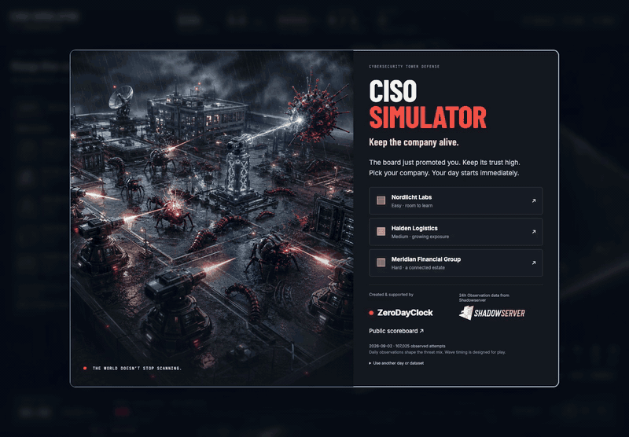
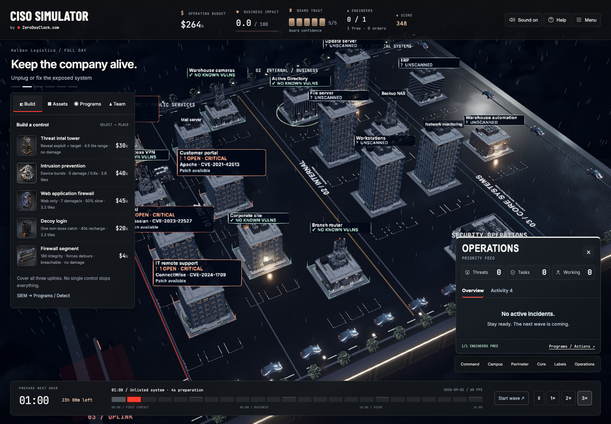

<div align="center">

# CISO SIMULATOR
### Your firewall works. Your board wants a meeting.

**One company. One day. Three uplinks. Absolutely no quiet tickets.**

[**PLAY IN YOUR BROWSER →**](https://game.zerodayclock.com) · [**PUBLIC SCOREBOARD ↗**](https://game.zerodayclock.com/scoreboard) · [Bring your own data](docs/DATA-SOURCES.md)



*Actual game capture. No install. No login required to play.*

</div>

You have been promoted to Chief Information Security Officer.

Your reward: ransomware, supply-chain compromise, a suspicious remote contractor, a regulator with questions, and a vendor who smells an emergency budget.

**Keep the company alive. Keep the board on your side. Try not to buy the same solution twice.**

## Your first day, in four moves

| 1 · Pick your company | 2 · Find the holes | 3 · Defend the business | 4 · Face the board |
|---|---|---|---|
| Startup, midcap or enterprise. Start with full board trust. | Fund a Scanner. Buildings reveal vendor/CVE findings. | Layer IPS, WAF, firewalls, programs and engineers. | Compare your verified score. Publish a callsign and superskill. |

<details>
<summary><b>See the command floor</b></summary>



</details>

## A tower-defense game with a CISO's problems

- **Three fronts, not one lane.** Defend the DMZ, internal services and core systems. Threats can also start inside.
- **Different tools, different jobs.** IPS intercepts device exploits. WAF slows web payloads. Identity protection matters when the attacker already has a password.
- **Consequences you can see.** Ransomware locks buildings. Data leaves the estate. Scanned flaws light up. Engineers travel to their work.
- **People are part of the attack surface.** Handle rogue insiders, contractor fraud, stressed engineering leaders and an opportunistic vendor.
- **One Operations view.** Active threats, outstanding decisions, governance work and activity history.
- **A full day in roughly 22 minutes at 1×.** Speed up to 3×. Easy starts gently; late-game pressure ramps up.
- **Three score categories.** Business resilience, defense effectiveness, and response & leadership. Spending money is not the same as spending it well.

> Suggested superskills: “Patching during the board meeting” · “Professional risk accepter” · “It was DNS”

## The public scoreboard

[Open the scoreboard →](https://game.zerodayclock.com/scoreboard)

At the end of a run, choose **Compare & submit score**. Add a callsign and superskill, consent to publication, and submit. Top scores compare the same difficulty, scenario and rules. Run history keeps previous submissions.

Scores are **recomputed server-side from the command journal**. Invented totals and duplicate tickets are rejected. No fake seed players or made-up rankings. Callsigns are pseudonyms, not verified identities; this is not a bot-proof competition.

## Real observations. Designed gameplay.

Created by [**🔴 ZeroDayClock.com**](https://zerodayclock.com), with **24h observation data from [The Shadowserver Foundation](https://www.shadowserver.org/)** informing the threat mix.

The bundled **2026-09-02** report contains **726 vulnerability/product rows and 107,025 observed attempts**. It is a fixed daily scenario, not a live feed. Waves and business consequences are designed for play—not a literal reconstruction of every connection.

### Turn your own telemetry into the next bad day

Adapt an authorized export from **ELK / Elastic, Splunk, Sentinel, your SIEM or your honeypots** to the game's JSON schema. Load it from the opening screen. No vendor-specific live connector is bundled.

**[Data adapter guide + example →](docs/DATA-SOURCES.md)**

Imports stay in your browser and play as practice scenarios. Do not include customer data, source IPs or secrets.

## Run it locally

```sh
git clone https://github.com/eppser/ciso-simulator.git
cd ciso-simulator
npm ci
npm run dev
```

Requires **Node 24+** and a modern WebGL-capable browser. Local play needs no Supabase or ElevenLabs key; the shared scoreboard needs a configured backend.

```sh
npm test
npm run build:release
node tools/super-audit.mjs
node tools/pacing-audit.mjs
```

## Under the hood

**Three.js + Blender-authored assets · deterministic simulation · generated voice performances · Cloudflare Pages · Supabase/Postgres with RLS**

| Change this | Start here |
|---|---|
| Organizations and assets | `src/sim/orgs.js` |
| Programs and controls | `src/sim/campaign-rules.js`, `src/sim/catalog.js` |
| Difficulty and late-game pressure | `src/sim/pacing.js` |
| Scoring and verification | `src/sim/scoring.js`, `src/sim/replay.js` |
| Your own data adapter | `src/sim/scenarios.js` |
| Campus, weather and animation | `src/render/` |
| Secure scoreboard | `server/`, `src/ui/leaderboard.js` |

**[Contribute](CONTRIBUTING.md)** · **[Deployment](docs/DEPLOYMENT.md)** · **[Security](SECURITY.md)** · **[Release audit](docs/RELEASE-AUDIT.md)** · **[Attribution](docs/ATTRIBUTION.md)**

Code is MIT-licensed. Third-party data, assets and trademarks retain their applicable rights. This game is not security, legal or compliance advice.

---

<div align="center">

**The world doesn't stop scanning.**

[**See if you can make it to midnight →**](https://game.zerodayclock.com)

If this feels uncomfortably like your job, star the project—and send it to your board.

</div>
